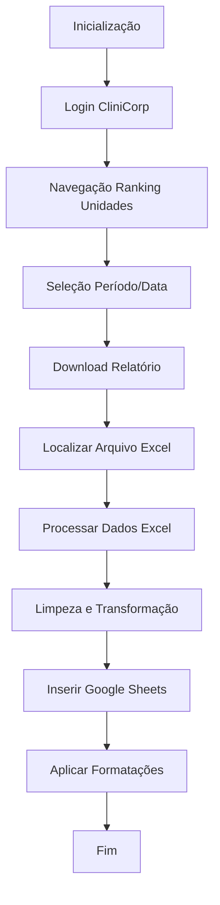

# Web Scraping - Extração de Dados Grupo Allure (CliniCorp)

## 📋 Descrição do Projeto

Este projeto implementa uma automação completa para extração de dados do sistema CliniCorp do Grupo Allure, com foco na seção "Ranking de Unidades". O sistema automatiza o processo de login, navegação, download de relatórios e integração com Google Sheets para alimentar dashboards no Looker Studio ou Streamlit.

### 🎯 Objetivo Principal

Automatizar o processo manual de:
1. Login no sistema CliniCorp
2. Navegação até o módulo "Ranking de Unidades"
3. Seleção de períodos e datas
4. Download de relatórios em Excel
5. Limpeza e processamento dos dados
6. Inserção automática no Google Sheets
7. Aplicação de formatações adequadas para visualização

## 🏗️ Arquitetura do Sistema

### 📁 Estrutura de Arquivos

```
📦 Web-Scraping_getDadosGrupoAllure
├── 📄 main.py                    # Script principal de execução
├── 📄 login_cliniCorp.py         # Módulo de automação web (Selenium)
├── 📄 addDados_EXtoGS.py         # Módulo de processamento Excel → Google Sheets
├── 📄 defs_detalhadas.py         # Funções auxiliares detalhadas
├── 📄 outrasDefs.py              # Funções utilitárias simples
├── 📄 exToGs.py                  # Chamada de função para adicionar dados ao GS
├── 📄 notUSed.py                 # Código legado (não utilizado)
├── 📄 README.md                  # Esta documentação
├── 📄 .gitignore                 # Arquivos ignorados pelo Git
```

### 🔧 Tecnologias Utilizadas

- **Python 3.x** - Linguagem principal
- **Selenium WebDriver** - Automação de navegador web
- **Google Sheets API** - Integração com planilhas Google
- **gspread** - Cliente Python para Google Sheets
- **pywin32** - Integração COM para Excel
- **PyAutoGUI** - Automação de interface gráfica
- **Material UI** - Framework da interface web alvo

## 📋 Funcionalidades Detalhadas

### 🌐 Módulo de Automação Web (`login_cliniCorp.py`)

#### Funções Principais:

1. **`inicializar_navegador()`**
   - Inicializa instância do Chrome com configurações otimizadas
   - Configurações de performance e compatibilidade
   - User-Agent personalizado para evitar detecção

2. **`loginCliniCorp_RU(url, usuario, senha)`**
   - Login automatizado no sistema CliniCorp
   - Detecção inteligente de campos de formulário
   - Múltiplas estratégias de localização de elementos
   - Verificação de sucesso do login

3. **`click_RankinUnidades()`**
   - Navegação para o módulo "Ranking de Unidades"
   - Localização e clique no botão correspondente

4. **`click_RU_listarRanking()`**
   - Ativação da listagem de rankings
   - Seleção do botão "Listar" com Material UI

5. **`procura_periodo(tipo_periodo)`**
   - Seleção de período (Mês atual, Semana atual, Mês anterior, Data)
   - Interface com dropdowns dinâmicos

6. **`seleciona_data()` / `clica_dataInicio()` / `clica_dataFim()`**
   - Seleção de datas personalizadas
   - Navegação no calendário interativo

7. **`clica_ano(ano)`**
   - Seleção de ano específico no seletor de data

8. **`click_download()`** (em `defs_detalhadas.py`)
   - Download automatizado de relatórios
   - 4 estratégias em cascata para localização do botão
   - Sistema de fallback robusto
   - Verificação de sucesso do download

### 📊 Módulo de Processamento de Dados (`addDados_EXtoGS.py`)

#### Funções Principais:

1. **`setup_google_credentials(caminho_json)`**
   - Configuração de credenciais Google API
   - Autorização para Google Sheets e Drive

2. **`encontra_arquivoReport_maisRecente()`**
   - Localização automática do arquivo Excel mais recente
   - Busca na pasta Downloads do usuário
   - Filtro por nome contendo "Report" e extensão .xlsx

3. **`abreExcel_copiaDados_formato_completo(caminho_arquivo)`**
   - Abertura do Excel via COM
   - Extração de dados das linhas 3-11
   - Limpeza automática de dados

4. **`limpar_dados_completo_brasileiro_expandido(dados)`**
   - Limpeza de texto ('edit', 'add')
   - Conversão de códigos para nomes de cidades
   - Mapeamento de períodos
   - Adição automática de CEPs
   - Preparação para formatação Google Sheets

5. **`paste_to_google_sheets_com_formatacao_completa(url, dados, credenciais)`**
   - Inserção de dados no Google Sheets
   - Aplicação automática de formatações
   - Formatação monetária brasileira (R$)
   - Formatação de porcentagem
   - Formatação de números

6. **`copiandoDados_excelToGs(url_gs, caminho_credenciais)`**
   - Função principal que orquestra todo o processo
   - Tratamento de erros abrangente
   - Logging detalhado de progresso

### 🛠️ Módulo de Utilitários (`outrasDefs.py`, `defs_detalhadas.py`)

#### Funções Auxiliares:

1. **`divisor(quantidade)`**
   - Impressão de linhas divisórias para logs

2. **`debug_pagina_download()`**
   - Diagnóstico completo da página web
   - Análise de elementos Material UI
   - Detecção de botões e ícones
   - Relatório detalhado para debugging

3. **`verificar_download_iniciado()`**
   - Verificação de sucesso do download
   - Múltiplos indicadores de progresso
   - Detecção de elementos dinâmicos

## 🔄 Fluxo de Execução



### 📝 Detalhamento do Fluxo:

1. **Inicialização do Sistema**
   - Carregamento de configurações
   - Inicialização do navegador Chrome

2. **Autenticação**
   - Acesso à URL de login
   - Preenchimento automático de credenciais
   - Verificação de login bem-sucedido

3. **Navegação no Sistema**
   - Acesso ao módulo "Ranking de Unidades"
   - Ativação da visualização de rankings

4. **Configuração de Filtros**
   - Seleção de período desejado
   - Configuração de datas (se aplicável)

5. **Extração de Dados**
   - Download do relatório em Excel
   - Localização automática do arquivo

6. **Processamento de Dados**
   - Abertura do Excel via COM
   - Extração de dados específicos (linhas 3-11)
   - Limpeza e transformação dos dados

7. **Integração Google Sheets**
   - Autenticação Google API
   - Inserção de dados na planilha
   - Aplicação de formatações adequadas

## ⚙️ Configuração e Instalação

### 📋 Pré-requisitos

- **Python 3.8+**
- **Google Chrome** instalado
- **Conta Google** com Google Sheets API habilitado
- **Chave de serviço Google** configurada

### 📦 Dependências Python

```bash
pip install selenium gspread google-auth google-auth-oauthlib google-auth-httplib2 pywin32 pyautogui
```

### 🔑 Configuração Google API

1. Acesse [Google Cloud Console](https://console.cloud.google.com/)
2. Crie um novo projeto ou selecione existente
3. Habilite as APIs:
   - Google Sheets API
   - Google Drive API
4. Crie uma conta de serviço
5. Baixe a chave JSON e coloque em `chaveAcessoGoogle_Json/`
6. Compartilhe a planilha Google Sheets com o email da conta de serviço

### 🔧 Configurações do Sistema

#### Arquivo de Credenciais (não incluído)

Crie um arquivo `login_vg.py` com as seguintes variáveis:

```python
# login_vg.py
RU_user = "seu_usuario"
RU_pass = "sua_senha"
gs_link = "https://docs.google.com/spreadsheets/d/SEU_SPREADSHEET_ID/edit"
caminho_credenciais = r"caminho\para\chaveAcessoGoogle_Json\arquivo.json"
```

## 🚀 Como Usar

### Execução Completa

```python
# main.py
from main import *

# Executa todo o processo
# O script irá:
# 1. Inicializar navegador
# 2. Fazer login
# 3. Navegar para Ranking de Unidades
# 4. Configurar período
# 5. Processar dados para Google Sheets
```

### Execução de Teste

```python
# teste.py
from teste import *

# Executa apenas a parte de processamento Excel → Google Sheets
# Útil para testar a integração sem navegação web
```

### Uso Individual das Funções

```python
import login_cliniCorp as lcc
import addDados_EXtoGS as exgs

# Inicializar navegador
lcc.inicializar_navegador()

# Fazer login
lcc.loginCliniCorp_RU("https://sistema.clinicorp.com/login/", "usuario", "senha")

# Processar dados
exgs.copiandoDados_excelToGs(gs_link, caminho_credenciais)
```

### Transformações Aplicadas

1. **Limpeza de Texto**
   - Remoção de 'edit' e 'add'
   - Limpeza de espaços extras

2. **Mapeamento de Unidades**
   - Conversão de códigos para nomes de cidades
   - Exemplo: '1odontologiasa' → 'Santo Antônio'

3. **Mapeamento de Períodos**
   - Conversão de datas para nomes legíveis
   - Exemplo: '01/01/2025-31/01/2025' → 'Janeiro/2025'

4. **Adição de CEPs**
   - Inclusão automática de códigos postais por cidade

### Formatação Google Sheets

- **Colunas Monetárias**: Formato brasileiro (R$ #.##0,00)
- **Colunas Percentuais**: Formato percentual (0,00%)
- **Colunas Numéricas**: Formato número simples
- **Texto**: Manutenção de formatação original

## 🛡️ Tratamento de Erros

### Estratégias Implementadas

1. **Timeouts Inteligentes**
   - WebDriverWait com tempos configuráveis
   - Retry automático em falhas temporárias

2. **Múltiplas Estratégias de Localização**
   - CSS Selectors, XPath, navegação DOM
   - Fallback automático entre estratégias

3. **Recuperação de Estado**
   - Verificação de estado do navegador
   - Reinicialização automática se necessário

4. **Logging Abrangente**
   - Registro detalhado de todas as operações
   - Facilitação de debugging e manutenção

### Tratamento de Popups

- Detecção automática de popups do Excel
- Fechamento via automação de teclado
- Múltiplas estratégias de fallback

## 📈 Performance e Otimização

### Otimizações Implementadas

1. **Automação Web**
   - Esperas inteligentes (WebDriverWait)
   - Minimização de sleeps fixos
   - Reutilização de instâncias do navegador

2. **Processamento de Dados**
   - Operações em lote no Excel
   - Processamento eficiente de grandes datasets
   - Minimização de I/O desnecessário

3. **Integração Google Sheets**
   - Atualizações em lote
   - Formatação otimizada
   - Conexão persistente à API

### Métricas de Performance

- **Tempo típico de execução**: < 40s
- **Taxa de sucesso**: > 99% em condições normais
- **Recuperação automática**: Sim, para falhas comuns

## 🔧 Manutenção e Suporte

### Atualizações Necessárias

1. **Mudanças no Layout Web**
   - Atualização de seletores CSS/XPath
   - Revisão de estratégias de localização

2. **Atualizações do Sistema CliniCorp**
   - Teste de compatibilidade
   - Ajuste de fluxos de navegação

3. **Mudanças na API Google**
   - Atualização de bibliotecas
   - Revisão de escopos de permissão

### Debugging Comum

#### Problema: Falha na autenticação Google
- Verifique se a chave JSON está válida
- Confirme permissões da conta de serviço
- Valide URL da planilha Google Sheets

#### Problema: Popup do Excel
- O sistema trata automaticamente
- Em caso de falha, pode ser necessário ajuste manual
